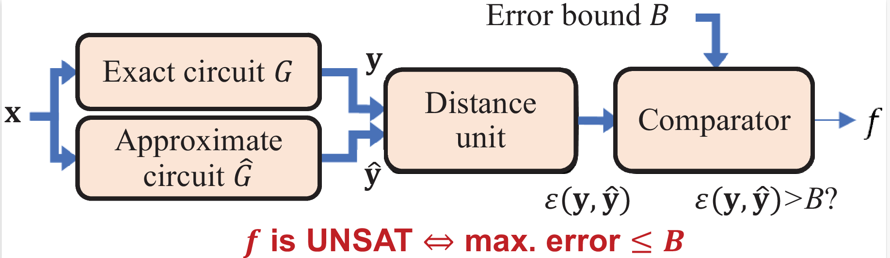

# MECALS

MECALS: maximum error checking technique for approximate logic synthesis.

This tool synthesizes approximate circuits under the maximum error constraint, such as worst-case error (WCE) and maximum square error (MaxSE) constraint. Its diagram is as follows.


## Publication

[C. Meng, J. Sun, Y. Mai, W. Qian, “MECALS: a maximum error checking technique for approximate logic
synthesis,” in ACM/IEEE Design, Automation & Test in Europe Conference & Exhibition (DATE), Antwerp,
Belgium, 2023.](https://github.com/SJTU-ECTL/MECALS/blob/master/misc/Meng - MECALS - A Maximum Error Checking Technique for Approximate Logic Synthesis.pdf)

## Dependencies

- Reference environment, **Ubuntu 20.04 LTS** with the following tools and libraries:

  - gcc 10.3.0 & g++ 10.3.0

    You can install these tools with the following command:

    ```shell
    sudo apt install gcc-10
    sudo apt install g++-10
    ```

    You also need to check whether the default versions of gcc and g++ are 10.3.0:

    ```shell
    gcc --version
    g++ --version
    ```

    If the default versions of gcc and g++ are not 10.3.0, please change them to 10.3.0.

  - [cmake](https://cmake.org/) 3.16.3

    You can install the tool using the following command:

    ```shell
    sudo apt install cmake
    ```

  - [yosys](https://github.com/YosysHQ/yosys)

    You can install the tool using the following command:

    ```shell
    sudo apt install yosys
    ```

  - [abc](https://github.com/changmg/abc)

    You need to manually compile *abc* and add the path where the executable program *abc* locates to the environment variable.

  - [libboost](https://www.boost.org/) 1.75.0

    You can download libboost 1.75.0, manually compile it, and then install it.

  - libreadline 8.0-4

    You can install the library using the following command

    ```shell
    sudo apt install libreadline-dev
    ```

- **Alternatively, we package a docker image containing the above dependencies:**

  https://hub.docker.com/r/changmeng/als_min

## How to Download

This project relies on two submodules:

- Open-source logic synthesis and verification tool [abc](https://github.com/changmg/abc/tree/f1b64be84071a431eac9871f8cdc71bc912fd75a)
- Open-source logic synthesis tool [espresso](https://github.com/changmg/espresso/tree/71e028a63f5b37814ef4bd6f7cdd602537d4c4ce)

There are two ways of downloading this project:

1. Clone the project, and then update the submodules:

```shell
git clone https://github.com/SJTU-ECTL/MECALS.git
git submodule init
git submodule update
```

2. Alternatively, clone the project as well as the submodules: 

```shell
git clone --recursive https://github.com/SJTU-ECTL/MECALS.git
```

## How to Build 

- To build, go to the root directory of the project, and then execute:

```shell
mkdir build
cd build
cmake ..
make
cd ..
```

An executable program called *als.out* will be generated at the project root directory.

- To clean up, go to the root directory of the project, and then execute:

```shell
rm -r build
```

## How to Run

- Example command:

```shell
./als.out -i input/benchmark/aig/mac.aig -m input/miter/width_8_wce_31.aig -l ./input/standard-cell/nangate_45nm_typ.lib -o tmp/ -p 1.0 --fSASIMI 1
```

In this example,

- The tool inputs the accurate circuit "input/benchmark/aig/mac.aig"

- The error constraint is specified by the **error miter** "input/miter/width_8_wce_31.aig". A general error miter is shown below.

  

  In the file "input/miter/width_8_wce_31.aig", both the outputs of exact and approximate circuits, $\mathbf y$ and $\mathbf {\hat y}$, have a bit width of 8. The WCE bound $B=31$, which means WCE should not exceed 31.

- It uses the standard cell library "./input/standard-cell/nangate_45nm_typ.lib" for technology mapping. 

- The approximate circuits will be outputted to the folder ./tmp

## Configurations

Use the following command to get help:

```shell
./als.out -h
```

The following information will be returned:

```shell
usage: ./als.out --accCirc=string --mitCirc=string [options] ... 
options:
  -i, --accCirc         path to accurate circuit (string)
  -m, --mitCirc         path to miter circuit (string)
  -a, --appCirc         path to approximate circuit; if this option is not empty, then error checking is performed (string [=])
  -l, --standCell       path to standard cell library (string [=input/standard-cell/nangate_45nm_typ.lib])
  -o, --outpPath        path to approximate circuits (string [=tmp/])
  -s, --seed            seed (unsigned int [=0])
  -f, --nFrame          #simulation patterns (int [=8192])
      --fSASIMI         flag of using SASIMI (int [=1])
  -p, --exactPBDPerc    proportion of exact PBD (double [=1])
  -h, --help            print this message
```

| Long parameter | Short parameter | Default value                   | Function                                                     |
| -------------- | --------------- | ------------------------------- | ------------------------------------------------------------ |
| --accCirc      | -i              | None                            | Path to accurate circuit, e.g., *input/benchmark/aig/mac.aig* |
| --mitCirc      | -m              | None                            | Path to error miter circuit, e.g., *input/miter/width_8_wce_31.aig*. You can find more error miters in the folder *input/miter/*. To specify an arbitrary miter, you can refer to the functions *GenWCEMit* and *GenMaxSEMit* in the Python code *script/run.py* |
| --appCirc      | -a              | ""                              | Path to approximate circuit. When "--appCirc" specifies a non-empty string, then the program will iteratively simplify the accurate circuit provided by "--accCirc". Otherwise, if "--appCirc" specifies an empty string "", then the program will check the maximum error of the approximate circuit provided by "--appCirc", compared to the accurate circuit provided by "--accCirc". |
| --standCell    | -l              | input/standard-cell/mcnc.genlib | Path to standard cell library, e.g., *./input/standard-cell/nangate_45nm_typ.lib* |
| --outpPath     | -o              | tmp                             | Specify the directory where the approximate circuits are outputed. |
| --seed         | -s              | 0                               | The seed used for generating random input patterns for logic simulation. When seed "0" is used, then the program randomly picks a seed. Otherwise, the program uses the specified seed. |
| --nFrame       | -f              | 8192                            | The number of random input patterns in logic simulation. In our work, simulation is used for quickly filtering some invalid local approximate changes (LACs). |
| --fSASIMI      |                 | 1                               | Whether to use SASIMI LAC or not. If "--fSASIMI" is set to 1, then both SASIMI and CONST LACs will be applied. Otherwise, if "--fSASIMI" is set to 0, then only the CONST LAC will be applied. Please refer to our paper to see the definitions of LACs. |
| --exactPBDPerc | -p              | 1                               | The proportion of nodes using exact partial Boolean difference. This value is a float-point number, ranging from 0.0 to 1.0. Its detailed definition is introduced in our paper. |
| --help         | -h              | None                            | Print help.                                                  |

